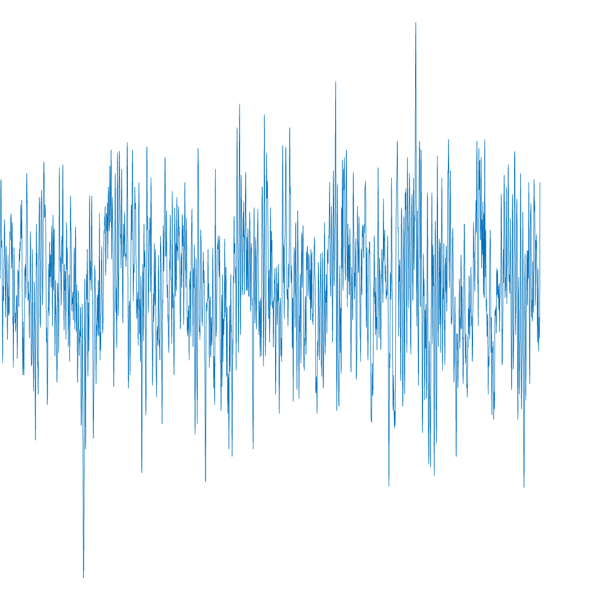

# EEG_Fractal_Dimension_Calculator

A MATLAB script for calculating the fractal dimension of EEG images using box-counting method.

# Preprocessing EEG Data Using EEGLab

This section describes how to use **EEGLab** to preprocess EEG signals from `.mat` files. 

---

## About EEGLab  
EEGLab is an open-source MATLAB toolbox designed for processing and analyzing EEG data. It provides a graphical interface and scripting capabilities, supporting tasks like filtering, ICA, and visualization.  

### Key Features of EEGLab:
- Graphical interface for interactive data exploration.
- Preprocessing capabilities such as filtering and artifact removal.
- Support for multiple EEG data formats (e.g., `.set`, `.edf`, `.mat`).

---

## Installation

### Requirements:
- **MATLAB**: EEGLab is compatible with versions from R2016b to R2023b.
- Toolboxes: Ensure Signal Processing and Image Processing Toolboxes are installed.

### Installation Steps:
1. Download EEGLab:
   - Visit the [EEGLab website](https://sccn.ucsd.edu/eeglab/download.php) and download the latest version.
2. Extract the downloaded `.zip` file to a folder on your computer.
3. Add EEGLab to your MATLAB path:
   ```matlab
   addpath('path_to_eeglab_folder');
   savepath;

Then Launching EEGLab, the EEGLab GUI will open, showing the main menu.
```matlab
eeglab;
```
---

## Converting EEG Data to Images

Ensure your .mat file is in the appropriate format, containing an EEG signal matrix and associated metadata (e.g., sampling rate, channel names). Select your .mat file and configure the import settings. Example MATLAB code for programmatic loading:
```matlab
% Load EEG data from .mat file
load('eeg_data.mat'); % Replace with your file
EEG = pop_importdata('dataformat', 'array', 'data', EEG_data, ...
                     'srate', sampling_rate, 'chanlocs', 'channel_locations.ced');
eeglab redraw;
```
After checking your EEG plot in EEGLab GUI, use MATLAB scripting to save EEG data plots:
```matlab
figure;
saveas(gcf, 'eeg_001.png');
close(gcf);
```
A great ouput will be shown like following:



## Automating Image Export for Multiple Files
If you have multiple .mat files, use the following MATLAB script to automate the process:
```matlab
% Directory containing .mat files
data_folder = 'path_to_eeg_files';
output_folder = 'path_to_save_images';
file_list = dir(fullfile(data_folder, '*.mat'));

% Loop through each file
for i = 1:length(file_list)
    % Load .mat file
    file_path = fullfile(data_folder, file_list(i).name);
    load(file_path); % Assumes EEG_data and sampling_rate exist in .mat
    
    % Import data to EEGLab
    EEG = pop_importdata('dataformat', 'array', 'data', EEG_data, ...
                         'srate', sampling_rate, 'chanlocs', 'channel_locations.ced');
    
    % Generate and save plot
    figure;
    pop_timtopo(EEG, [0 EEG.xmax*1000], [NaN]);
    saveas(gcf, fullfile(output_folder, [file_list(i).name, '.png']));
    close(gcf);
end
```

